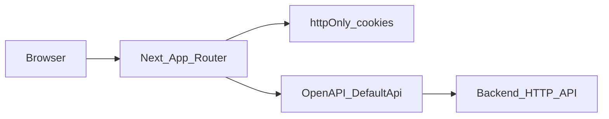

# TanárSegéd — Frontend Developer Guide

This guide is for developers working on the **TanárSegéd web frontend**: application structure, backend integration, authentication and data fetching, and where the main features live in code. **HTTP API implementation details:** [Backend Developer Guide](../../backend/docs/DEV_GUIDE.en.md). For **teacher-facing product behaviour**, see the **[English](USER_GUIDE.en.md)** or **[Hungarian](USER_GUIDE.hu.md)** user guide.

---

## 1. Introduction

In this repository **TanárSegéd** is a **Next.js** application: teacher Dashboard, draft editor, worksheet (“dolgozat”) flows, class management, and public share routes. The **backend is a separate HTTP API**; the workspace includes an **OpenAPI** description and a generated **TypeScript client** so the UI matches the documented endpoints.

---

## 2. High-level architecture

The browser loads the **Next.js (App Router)** app. **Server Components** and **Server Actions** read auth cookies and call the API as needed. The generated **`DefaultApi`** client (`src/api`) uses **`fetch`** against `API_BASE_PATH`, attaches a **Bearer** token in middleware, and on **401** retries once after **refresh** (except on `/auth/refresh`). **TanStack Query** handles client-side caching on many screens.

---

## 3. Tech stack

| Layer | Choice |
|--------|--------|
| Framework | [Next.js](https://nextjs.org) 16 (App Router) |
| UI | React 19, TypeScript |
| Styling | Tailwind CSS 4, `globals.css` |
| Components | Radix-oriented primitives under `src/components/ui/` (shadcn-style), CVA, `tailwind-merge` |
| Forms | `react-hook-form`, `@hookform/resolvers`, Zod |
| Server / client data | TanStack React Query (`QueryProvider` in root layout) |
| Local UI state | Zustand (e.g. navbar store) |
| Rich text | Slate, `slate-history`, `slate-react` |
| Drag and drop | `@dnd-kit/react` / `@dnd-kit/dom` |
| Motion / feedback | Framer Motion, `sonner` toasts |
| Icons | `lucide-react`, `@hugeicons/react` |
| API client | OpenAPI Generator, `typescript-fetch` → `src/api/` |
| Package runner | Scripts use `bun x`; without Bun you can run equivalents with `npx` |

---

## 4. Repository layout (frontend)

Paths are relative to the `frontend/` directory.

| Path | Role |
|------|------|
| `app/` | Routes, layouts, route-local `_components` (e.g. worksheet editor) |
| `app/globals.css` | Global styles and Tailwind entry |
| `src/components/` | Shared UI: `ui/`, `dashboard/`, `slate/`, providers |
| `src/features/` | Feature hooks and logic (e.g. `drafts/`) |
| `src/lib/` | API helpers, auth, Slate/editor utilities |
| `src/actions/` | Server Actions (`"use server"`), e.g. auth cookies |
| `src/api/` | **Generated** — do not edit by hand; regenerate from `openapi.yaml` |
| `src/store/` | Client stores (Zustand) |
| `openapi.yaml` | OpenAPI 3 spec used to generate `src/api/` |
| `next.config.ts` | Next configuration (`output: "standalone"`) |
| `public/` | Static assets |

**Path alias:** `@/*` maps to `src/*` (`tsconfig.json`).

---

## 5. Environment variables

| Variable | Purpose |
|----------|---------|
| `NEXT_PUBLIC_API_URL` | Backend origin **without** a trailing slash. Value used as `API_BASE_PATH` in [`src/lib/apiBase.ts`](../src/lib/apiBase.ts). Helps simplify deployment. |

If unset, the default is `http://localhost:3020`. There is **no committed `.env`** in this repo; create a local `.env.local` (or your host’s equivalent).

---

## 6. NPM scripts

| Script | Command (from `package.json`) | Meaning |
|--------|-------------------------------|---------|
| `dev` | `bun x next dev` | Development server (default port 3000) |
| `build` | `bun x next build` | Production build |
| `start` | `bun x next start` | Serve production build |
| `lint` | `bun x eslint` | ESLint |
| `generate-client` | `openapi-generator-cli generate -i openapi.yaml -g typescript-fetch -o ./src/api` | Regenerate `src/api/` |

After changing **`openapi.yaml`**, run **`generate-client`**, and if your workflow expects it, commit the regenerated client.

---

## 7. Backend integration and API client

- **Spec:** [`openapi.yaml`](../openapi.yaml) at the frontend root.
- **Runtime:** [`src/lib/api.ts`](../src/lib/api.ts) instantiates `DefaultApi` with `API_BASE_PATH` and **middleware** that (1) sets `Authorization: Bearer <access>` from cookies and (2) on **401**, runs a deduped `refreshTokenAction` and retries once (not under `/auth/refresh`).
- **Server-side calls:** `getServerApi()` in the same file builds a `Configuration` with the current access token — used e.g. by [`src/lib/auth-server.ts`](../src/lib/auth-server.ts).

If the **canonical OpenAPI** lives in another repo, keep **`openapi.yaml` here in sync** (or generate it in CI) so types and paths match the deployed API.

---

## 8. Authentication and session

- **Cookies (httpOnly):** `tnrsgd_accessToken`, `tnrsgd_refreshToken` — [`src/actions/auth.ts`](../src/actions/auth.ts) (`setAuthCookies`, `deleteAuthCookies`, `getAuthCookies`).
- **Session for RSC:** [`getSession()`](../src/lib/auth-server.ts) calls `api.authSessionGet()`; on **401**, `refreshTokenAction`, then retry.
- **Protected dashboard:** [`app/dashboard/layout.tsx`](../app/dashboard/layout.tsx) — no session user → **redirect** to `/auth/login`.
- **Client context:** [`AuthProvider`](../src/components/AuthProvider.tsx) wraps dashboard children (see layout).

Registration and sign-in live under **`/auth/register`** and **`/auth/login`** (`app/auth/...`). The **`/createaccount`** route is a separate page — treat it as **secondary / legacy** until product states otherwise.

---

## 9. Routing and layouts

| Layout / file | Role |
|---------------|------|
| [`app/layout.tsx`](../app/layout.tsx) | Root HTML, `Inter`, **`QueryProvider`**, **`Toaster`**, default **dark** on `<body>` |
| [`app/dashboard/layout.tsx`](../app/dashboard/layout.tsx) | Auth check, `DashboardNavbar`, `AuthProvider` |
| [`app/share/layout.tsx`](../app/share/layout.tsx) | Layout for public share routes |
| [`app/dashboard/vazlatok/[id]/layout.tsx`](../app/dashboard/vazlatok/[id]/layout.tsx) | Draft detail route layout |

**Common route prefixes** (today’s `app/` structure):

| Area | Paths |
|------|--------|
| Landing | `/` |
| Auth | `/auth/login`, `/auth/register` |
| Dashboard home | `/dashboard` |
| Drafts | `/dashboard/vazlatok`, `/dashboard/vazlatok/[id]` |
| Worksheets (list + editor) | `/dashboard/dolgozatok`, `/dashboard/dolgozatszerkeszto` |
| Classes | `/dashboard/classes`, `/dashboard/classes/classlist`, `/dashboard/classes/classcreate`, `/dashboard/classes/[id]` |
| Shared draft (read-oriented) | `/share/vazlatok/[token]` |

New routes may appear as the app grows — **source of truth** is the `app/` tree.

---

## 10. Feature areas (where to edit)

| Feature | Starting points |
|---------|-----------------|
| **Drafts** | `app/dashboard/vazlatok/`, `src/features/drafts/`, `src/components/slate/`, `src/lib/` (sync, sharing, etc.) |
| **Worksheets** | `app/dashboard/dolgozatok/page.tsx`, `app/dashboard/dolgozatszerkeszto/` (canvas, question types, Zod schemas under `_components/form/`) |
| **Classes** | `app/dashboard/classes/...` |
| **Share** | `app/share/vazlatok/[token]/` |
| **Dashboard chrome** | `src/components/dashboard/` (navbar, dynamic island) |

---

## 11. UI and theming

- Global styles: [`app/globals.css`](../app/globals.css).
- Root layout applies **dark** class on `<body>`; `next-themes` is available if you extend theming.
- For new controls, prefer patterns from **`src/components/ui/*`** (spacing, accessibility).

---

## 12. Quality and tests

- **Lint:** `npm run lint` / `bun run lint`, **eslint-config-next**.
- **Tests:** The repo may contain **narrow unit tests** alongside implementation (e.g. Slate streaming). **Full** automated coverage is not documented in this package — follow lint, manual QA, and your team’s CI.

Frontend testing does not become mandatory on its own, but once the server changes endpoint behaviour (e.g. AI editing flows), tests help keep behaviour stable. That can save a lot of production surprises.

---

## 13. Build and deployment notes

- [`next.config.ts`](../next.config.ts): **`output: "standalone"`** — **container-friendly** production output (`.next/standalone`). Align Docker/host setup with [Next.js standalone deployment](https://nextjs.org/docs/app/building-your-application/deploying).
- In production, set **`NEXT_PUBLIC_API_URL`** so the browser and server actions call the correct API origin.

---

## 14. Glossary and disclaimer

| Term | Meaning in this frontend |
|------|---------------------------|
| **OpenAPI client** | Generated `src/api` TypeScript classes for REST paths from `openapi.yaml`. |
| **`API_BASE_PATH`** | Backend base URL (`NEXT_PUBLIC_API_URL` or localhost default). |
| **RSC** | React Server Components — App Router default. |
| **Server Action** | Function marked `"use server"` (e.g. cookies, refresh). |
| **Vázlat** | Draft document in the Slate editor. |
| **Dolgozat** | Worksheet module in the Dashboard. |

This document describes the **frontend in this repository**. **Production URLs, feature flags, and backend behaviour** may differ — always verify against the running API and the current `app/` tree.

---

*End-user perspective: [USER_GUIDE.en.md](USER_GUIDE.en.md) · [USER_GUIDE.hu.md](USER_GUIDE.hu.md)*
