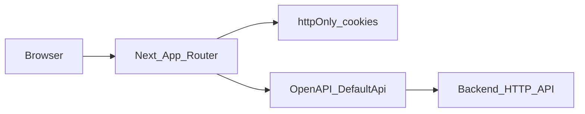

# TanárSegéd — Frontend Developer Guide

This guide is for **contributors working on the TanárSegéd web frontend**: how the app is structured, how it talks to the backend, how auth and data fetching work, and where to find the main feature code. For teacher-facing product behaviour, see the **[user guide (English)](USER_GUIDE.en.md)** or **[Hungarian](USER_GUIDE.hu.md)**.

---

## 1. Introduction

**TanárSegéd** (“Teacher’s Assistant”) in this repository is the **Next.js** single-page application that implements the teacher dashboard, draft editor, exam (“dolgozat”) flows, class management, and public share views. The **backend is a separate HTTP API**; this workspace ships an **OpenAPI** description and a **generated TypeScript client** so the UI stays aligned with documented endpoints.

**Primary audience:** frontend engineers touching `app/`, `src/`, or the OpenAPI client. **Out of scope:** backend database design, server deployment of the API (only what the UI needs to run locally or in staging).

---

## 2. High-level architecture

The browser loads **Next.js (App Router)**. **Server Components and Server Actions** read auth cookies and call the API where appropriate. The **generated `DefaultApi` client** (`src/api`) performs `fetch` to `API_BASE_PATH`, attaches **Bearer** tokens via middleware, and on **401** retries after a **refresh** (except on `/auth/refresh`). **TanStack Query** wraps client-side caching for many interactive screens.

---

## 3. Tech stack

| Layer | Choice |
|--------|--------|
| Framework | [Next.js](https://nextjs.org) 16 (App Router) |
| UI | React 19, TypeScript |
| Styling | Tailwind CSS 4, `globals.css` |
| Components | Radix-oriented primitives under `src/components/ui/` (shadcn-style), CVA, `tailwind-merge` |
| Forms | `react-hook-form`, `@hookform/resolvers`, Zod |
| Server / client data | TanStack React Query (`QueryProvider` in root layout) |
| Local UI state | Zustand (e.g. navbar store) |
| Rich text | Slate, `slate-history`, `slate-react` |
| Drag and drop | `@dnd-kit/react` / `@dnd-kit/dom` |
| Motion / UX | Framer Motion, `sonner` toasts |
| Icons | `lucide-react`, `@hugeicons/react` |
| API client | OpenAPI Generator, `typescript-fetch` → `src/api/` |
| Package runner | Scripts use `bun x` for Next/ESLint; you can substitute `npx` if you do not use Bun |

---

## 4. Repository layout (frontend)

Paths are relative to the `frontend/` directory.

| Path | Role |
|------|------|
| `app/` | Routes, layouts, route-local `_components` (e.g. exam editor) |
| `app/globals.css` | Global styles and Tailwind entry |
| `src/components/` | Shared UI: `ui/`, `dashboard/`, `slate/`, providers |
| `src/features/` | Feature hooks and logic (e.g. `drafts/`) |
| `src/lib/` | API helpers, auth helpers, Slate/editor utilities |
| `src/actions/` | Server Actions (`"use server"`), e.g. auth cookies |
| `src/api/` | **Generated** — do not hand-edit; regenerate from `openapi.yaml` |
| `src/store/` | Client stores (Zustand) |
| `openapi.yaml` | OpenAPI 3 spec used to generate `src/api/` |
| `next.config.ts` | Next configuration (`output: "standalone"`) |
| `public/` | Static assets |

**Path alias:** `@/*` maps to `src/*` (`tsconfig.json`).

---

## 5. Environment variables

| Variable | Purpose |
|----------|---------|
| `NEXT_PUBLIC_API_URL` | Backend origin **without** a trailing slash. Used as `API_BASE_PATH` in [`src/lib/apiBase.ts`](../src/lib/apiBase.ts). |

If unset, the client defaults to `http://localhost:3020`. There is **no committed `.env`** in this repo; create a local `.env.local` (or your host’s equivalent) as needed.

---

## 6. NPM scripts

| Script | Command (from `package.json`) | Meaning |
|--------|-------------------------------|---------|
| `dev` | `bun x next dev` | Development server (default port 3000) |
| `build` | `bun x next build` | Production build |
| `start` | `bun x next start` | Serve production build |
| `lint` | `bun x eslint` | ESLint |
| `generate-client` | `openapi-generator-cli generate -i openapi.yaml -g typescript-fetch -o ./src/api` | Regenerate `src/api/` |

After changing **`openapi.yaml`**, run **`generate-client`** and commit the regenerated client if your workflow requires it.

---

## 7. Backend integration and API client

- **Spec:** [`openapi.yaml`](../openapi.yaml) at the frontend root.
- **Runtime:** [`src/lib/api.ts`](../src/lib/api.ts) instantiates `DefaultApi` with `API_BASE_PATH` and **middleware** that (1) injects `Authorization: Bearer <access>` from cookies and (2) on **401**, calls a deduped `refreshTokenAction` and retries once (not for `/auth/refresh`).
- **Server-side calls:** `getServerApi()` in the same file builds a `Configuration` with the current access token from cookies — used e.g. by [`src/lib/auth-server.ts`](../src/lib/auth-server.ts).

If the **canonical OpenAPI** lives in another repo, keep **`openapi.yaml` here in sync** (or replace generation with a CI step) so types and paths match the deployed API.

---

## 8. Authentication and session

- **Cookies (httpOnly):** `tnrsgd_accessToken`, `tnrsgd_refreshToken` — set/cleared in [`src/actions/auth.ts`](../src/actions/auth.ts) (`setAuthCookies`, `deleteAuthCookies`, `getAuthCookies`).
- **Session for RSC:** [`getSession()`](../src/lib/auth-server.ts) calls `api.authSessionGet()`; on **401** it attempts refresh via `refreshTokenAction` and retries.
- **Protected dashboard:** [`app/dashboard/layout.tsx`](../app/dashboard/layout.tsx) — if there is no session user, **redirect** to `/auth/login`.
- **Client context:** [`AuthProvider`](../src/components/AuthProvider.tsx) wraps dashboard children (see layout) for user context on the client.

Registration and sign-in UX live under **`/auth/register`** and **`/auth/login`** (`app/auth/...`). The route **`/createaccount`** exists as a separate page; treat it as **secondary / legacy** unless product explicitly standardises on it.

---

## 9. Routing and layouts

| Layout / file | Role |
|---------------|------|
| [`app/layout.tsx`](../app/layout.tsx) | Root HTML shell, `Inter`, **`QueryProvider`**, **`Toaster`**, default **dark** on `<body>` |
| [`app/dashboard/layout.tsx`](../app/dashboard/layout.tsx) | Auth gate, `DashboardNavbar`, `AuthProvider` |
| [`app/share/layout.tsx`](../app/share/layout.tsx) | Layout for public share routes |
| [`app/dashboard/vazlatok/[id]/layout.tsx`](../app/dashboard/vazlatok/[id]/layout.tsx) | Draft detail route layout |

**Common route prefixes** (as implemented under `app/` today):

| Area | Paths |
|------|--------|
| Landing | `/` |
| Auth | `/auth/login`, `/auth/register` |
| Dashboard home | `/dashboard` |
| Drafts | `/dashboard/vazlatok`, `/dashboard/vazlatok/[id]` |
| Exams (list + editor) | `/dashboard/dolgozatok`, `/dashboard/dolgozatszerkeszto` |
| Classes | `/dashboard/classes`, `/dashboard/classes/classlist`, `/dashboard/classes/classcreate`, `/dashboard/classes/[id]` |
| Shared draft (read-oriented) | `/share/vazlatok/[token]` |

Additional routes may appear as the app grows; **source of truth** is the `app/` tree.

---

## 10. Feature areas (where to edit)

| Feature | Starting points |
|---------|-----------------|
| **Drafts** | `app/dashboard/vazlatok/`, `src/features/drafts/`, `src/components/slate/` (editor, toolbar, chat panel), `src/lib/` helpers (`useDraftRemoteSync`, share helpers, etc.) |
| **Exams (“dolgozat”)** | `app/dashboard/dolgozatok/page.tsx`, `app/dashboard/dolgozatszerkeszto/` (canvas, question types, Zod schemas under `_components/form/`) |
| **Classes** | `app/dashboard/classes/...` |
| **Share** | `app/share/vazlatok/[token]/` |
| **Dashboard chrome** | `src/components/dashboard/` (navbar, dynamic island) |

---

## 11. UI and theming

- Global styles: [`app/globals.css`](../app/globals.css).
- Root layout applies **dark mode** class on `<body>`; `next-themes` is a dependency if you extend theming.
- Prefer existing **`src/components/ui/*`** patterns for new controls to keep spacing and accessibility consistent.

---

## 12. Quality and tests

- **Lint:** `npm run lint` / `bun run lint` with **eslint-config-next**.
- **Tests:** The repo may contain **targeted unit tests** next to implementation files (e.g. Slate streaming helpers). There is **no** documented full test matrix in this package; rely on lint, manual QA, and your team’s CI.

---

## 13. Build and deployment notes

- [`next.config.ts`](../next.config.ts) sets **`output: "standalone"`** for **container-friendly** production output (`.next/standalone`). Align your Docker or host recipe with [Next.js standalone deployment](https://nextjs.org/docs/app/building-your-application/deploying).
- Set **`NEXT_PUBLIC_API_URL`** in the deployment environment so the browser and server actions hit the correct API origin.

---

## 14. Glossary and disclaimer

| Term | Meaning in this frontend |
|------|---------------------------|
| **OpenAPI client** | Generated `src/api` TypeScript classes wrapping REST paths from `openapi.yaml`. |
| **`API_BASE_PATH`** | Backend base URL (from `NEXT_PUBLIC_API_URL` or localhost default). |
| **RSC** | React Server Components — default in App Router. |
| **Server Action** | Function marked `"use server"` (e.g. cookie mutations, refresh). |
| **Vázlat** | Draft document in the Slate-based editor. |
| **Dolgozat** | Exam / assessment module in the dashboard. |

This document reflects the **frontend layout and tooling** in this repository at the time of writing. **Deployed URLs, feature flags, and backend behaviour** may differ — verify against the running API and the live `app/` tree.

---

*End-user perspective: [USER_GUIDE.en.md](USER_GUIDE.en.md) · [USER_GUIDE.hu.md](USER_GUIDE.hu.md)*
