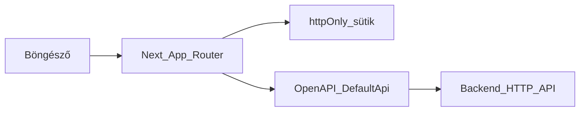

# TanárSegéd — Frontend fejlesztői útmutató

Ez az útmutató a **TanárSegéd webes frontendjét** fejlesztőknek íródott: alkalmazás felépítése, backend-kapcsolat, autentikáció és adatlekérés, valamint a fő funkciók kóbeli helye. A **tanári, felhasználói viselkedés** leírásához lasd az **[angol](USER_GUIDE.en.md)** vagy **[magyar](USER_GUIDE.hu.md)** felhasználói útmutatót.

---

## 1. Bevezetés

A repóban a **TanárSegéd** egy **Next.js** alkalmazás: tanári műszerfal, vázlatszerkesztő, dolgozat folyamatok, osztálykezelés és nyilvános megosztás útvonalak. A **backend külön HTTP API**; a workspace tartalmaz egy **OpenAPI** leírást és belőle generált **TypeScript klienst**, hogy a felület egyezzen a dokumentált végpontokkal.

---

## 2. Architektúra nagy vonalakban

A böngésző a **Next.js (App Router)** alkalmazást tölti be. **Server Component-ek** és **Server Action-ök** olvassák az auth sütiket, és szükség szerint hívják az API-t. A generált **`DefaultApi`** (`src/api`) **`fetch`**-tel hívja a `API_BASE_PATH`-ot, **Bearer** tokent tesz a middleware-ben, **401** esetén **refresh** után egyszer újrapróbál (kivéve `/auth/refresh` esetén). Számos képernyőn **TanStack Query** kezeli a kliens oldali cache-t.

---

## 3. Technológiai stack

| Réteg | Választás |
|--------|------------|
| Keretrendszer | [Next.js](https://nextjs.org) 16 (App Router) |
| UI | React 19, TypeScript |
| Stílus | Tailwind CSS 4, `globals.css` |
| Komponensek | Radix-jellegű primitívek az `src/components/ui/` alatt (shadcn-stílus), CVA, `tailwind-merge` |
| Űrlapok | `react-hook-form`, `@hookform/resolvers`, Zod |
| Szerver / kliens adat | TanStack React Query (root layoutban `QueryProvider`) |
| Lokális UI állapot | Zustand (pl. navbar store) |
| Rich text | Slate, `slate-history`, `slate-react` |
| Drag and drop | `@dnd-kit/react` / `@dnd-kit/dom` |
| Animáció / visszajelzés | Framer Motion, `sonner` toastok |
| Ikonok | `lucide-react`, `@hugeicons/react` |
| API-kliens | OpenAPI Generator, `typescript-fetch` → `src/api/` |
| Parancs-futtató | A scriptek `bun x`-et használnak; Bun nélkül pl. `npx`-szel is futtathatók |

---

## 4. Könyvtárstruktúra (frontend)

Az útvonalak a `frontend/` mappához képest értendők.

| Útvonal | Szerep |
|---------|--------|
| `app/` | Útvonalak, layoutok, route-lokális `_components` (pl. dolgozat-szerkesztő) |
| `app/globals.css` | Globális stílusok és Tailwind belépő |
| `src/components/` | Megosztott UI: `ui/`, `dashboard/`, `slate/`, providerek |
| `src/features/` | Funkció-hookok és logika (pl. `drafts/`) |
| `src/lib/` | API segédek, auth, Slate/editor utilok |
| `src/actions/` | Server Actions (`"use server"`), pl. auth sütik |
| `src/api/` | **Generált** — kézzel ne szerkeszd; `openapi.yaml` alapján regeneráld |
| `src/store/` | Kliens store-ok (Zustand) |
| `openapi.yaml` | OpenAPI 3 spec a `src/api/` generálásához |
| `next.config.ts` | Next beállítások (`output: "standalone"`) |
| `public/` | Statikus assetek |

**Alias:** a `@/*` a `src/*`-ra mutat (`tsconfig.json`).

---

## 5. Környezeti változók

| Változó | Cél |
|---------|-----|
| `NEXT_PUBLIC_API_URL` | Backend origin **perjel nélkül**. A [`src/lib/apiBase.ts`](../src/lib/apiBase.ts) `API_BASE_PATH` értéke. |

Ha nincs megadva, az alapértelmezés `http://localhost:3020`. A repóban **nincs commitolt `.env`**; helyben hozz létre `.env.local`-t (vagy a host megfelelőjét).

---

## 6. NPM scriptek

| Script | Parancs (`package.json`) | Jelentés |
|--------|---------------------------|----------|
| `dev` | `bun x next dev` | Fejlesztői szerver (alapértelmezett port 3000) |
| `build` | `bun x next build` | Éles build |
| `start` | `bun x next start` | Éles build kiszolgálása |
| `lint` | `bun x eslint` | ESLint |
| `generate-client` | `openapi-generator-cli generate -i openapi.yaml -g typescript-fetch -o ./src/api` | `src/api/` újragenerálása |

Az **`openapi.yaml`** módosítása után futtasd a **`generate-client`**-et, és ha a csapatod így dolgozik, commitold a generált klienst.

---

## 7. Backend integráció és API-kliens

- **Spec:** [`openapi.yaml`](../openapi.yaml) a frontend gyökerében.
- **Futásidő:** [`src/lib/api.ts`](../src/lib/api.ts) példányosítja a `DefaultApi`-t `API_BASE_PATH`-szal és **middleware-mel**: (1) `Authorization: Bearer <access>` a sütikből, (2) **401** esetén deduplikált `refreshTokenAction` és egy újrapróbálás (nem `/auth/refresh` alatt).
- **Szerver hívások:** ugyanebben a fájlban a `getServerApi()` az aktuális access tokennel épít `Configuration`t — pl. [`src/lib/auth-server.ts`](../src/lib/auth-server.ts).

Ha a **kanonikus OpenAPI** más repóban él, tartsd **szinkronban** a frontend `openapi.yaml`-jét (vagy CI-ből generáld), hogy a típusok és útvonalak egyezzenek az éles API-val.

---

## 8. Autentikáció és session

- **Sütik (httpOnly):** `tnrsgd_accessToken`, `tnrsgd_refreshToken` — [`src/actions/auth.ts`](../src/actions/auth.ts) (`setAuthCookies`, `deleteAuthCookies`, `getAuthCookies`).
- **Session RSC-hez:** [`getSession()`](../src/lib/auth-server.ts) meghívja az `api.authSessionGet()`-et; **401** esetén `refreshTokenAction`, majd újrapróbálkozás.
- **Védett műszerfal:** [`app/dashboard/layout.tsx`](../app/dashboard/layout.tsx) — nincs session user → **átirányítás** `/auth/login`.
- **Kliens kontextus:** [`AuthProvider`](../src/components/AuthProvider.tsx) a dashboard gyerekeit becsomagolja (lásd layout).

Regisztráció és bejelentkezés: **`/auth/register`**, **`/auth/login`** (`app/auth/...`). A **`/createaccount`** útvonal külön oldal — kezeld **másodlagos / legacy** jellegűnek, amíg a termék másként nem rögzíti.

---

## 9. Routing és layoutok

| Layout / fájl | Szerep |
|----------------|--------|
| [`app/layout.tsx`](../app/layout.tsx) | Root HTML, `Inter`, **`QueryProvider`**, **`Toaster`**, alapértelmezett **dark** a `<body>`-n |
| [`app/dashboard/layout.tsx`](../app/dashboard/layout.tsx) | Auth ellenőrzés, `DashboardNavbar`, `AuthProvider` |
| [`app/share/layout.tsx`](../app/share/layout.tsx) | Nyilvános megosztás útvonalak layoutja |
| [`app/dashboard/vazlatok/[id]/layout.tsx`](../app/dashboard/vazlatok/[id]/layout.tsx) | Vázlat részletező route layout |

**Gyakori útvonal-előtagok** (a mai `app/` struktúra szerint):

| Terület | Útvonalak |
|---------|-----------|
| Nyitóoldal | `/` |
| Auth | `/auth/login`, `/auth/register` |
| Műszerfal kezdőlap | `/dashboard` |
| Vázlatok | `/dashboard/vazlatok`, `/dashboard/vazlatok/[id]` |
| Dolgozatok (lista + szerkesztő) | `/dashboard/dolgozatok`, `/dashboard/dolgozatszerkeszto` |
| Osztályok | `/dashboard/classes`, `/dashboard/classes/classlist`, `/dashboard/classes/classcreate`, `/dashboard/classes/[id]` |
| Megosztott vázlat (olvasás) | `/share/vazlatok/[token]` |

Új útvonalak az alkalmazás növekedésével jöhetnek — **forrás az `app/` fa**.

---

## 10. Funkcióterületek (hol szerkeszd)

| Funkció | Kiinduló helyek |
|---------|-----------------|
| **Vázlatok** | `app/dashboard/vazlatok/`, `src/features/drafts/`, `src/components/slate/`, `src/lib/` (sync, megosztás, stb.) |
| **Dolgozatok** | `app/dashboard/dolgozatok/page.tsx`, `app/dashboard/dolgozatszerkeszto/` (canvas, kérdéstípusok, Zod sémák `_components/form/` alatt) |
| **Osztályok** | `app/dashboard/classes/...` |
| **Megosztás** | `app/share/vazlatok/[token]/` |
| **Műszerfal keret** | `src/components/dashboard/` (navbar, dynamic island) |

---

## 11. UI és téma

- Globális stílus: [`app/globals.css`](../app/globals.css).
- A root layout **dark** class-t ad a `<body>`-nak; a `next-themes` függőség kiterjeszthető további témákhoz.
- Új vezérlőknél előny az **`src/components/ui/*`** minták követése (térköz, akadálymentesség).

---

## 12. Minőség és tesztek

- **Lint:** `npm run lint` / `bun run lint`, **eslint-config-next**.
- **Tesztek:** a repóban lehetnek **szűk fókuszú unit tesztek** az implementáció mellett (pl. Slate streaming). **Teljes** automatizált lefedettség nincs leírva ebben a csomagban — lint, kézi QA és a csapat CI-je szerint haladj.

---

## 13. Build és deploy

- [`next.config.ts`](../next.config.ts): **`output: "standalone"`** — **konténerbarát** éles kimenet (`.next/standalone`). A [Next.js standalone deploy](https://nextjs.org/docs/app/building-your-application/deploying) szerint hangold össze a Docker/host receptet.
- Éles környezetben állítsd be a **`NEXT_PUBLIC_API_URL`**-t, hogy a böngésző és a server actionök a megfelelő API origint hívják.

---

## 14. Szótár és felelősségkorlátozás

| Kifejezés | Jelentés ebben a frontendben |
|-----------|------------------------------|
| **OpenAPI kliens** | Generált `src/api` TypeScript osztályok, az `openapi.yaml` REST útvonalaihoz. |
| **`API_BASE_PATH`** | Backend bázis URL (`NEXT_PUBLIC_API_URL` vagy localhost alapértelmezés). |
| **RSC** | React Server Components — App Router alapértelmezés. |
| **Server Action** | `"use server"` függvény (pl. sütik, refresh). |
| **Vázlat** | Vázlat-dokumentum a Slate szerkesztőben. |
| **Dolgozat** | Dolgozat modul a műszerfalon. |

Ez a dokumentum a **jelen repóbeli frontend** felépítését írja le. **Éles URL-ek, feature flagek és backend viselkedés** eltérhet — mindig ellenőrizd a futó API-val és az aktuális `app/` fával.

---

*Felhasználói szemszög: [USER_GUIDE.en.md](USER_GUIDE.en.md) · [USER_GUIDE.hu.md](USER_GUIDE.hu.md)*
