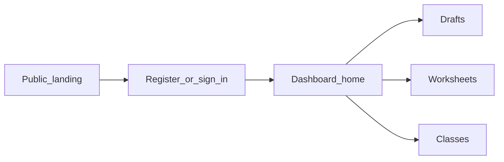

# TanárSegéd — User guide

This guide presents the **TanárSegéd** service from a **teacher’s perspective**: what it is for, how to navigate it, and what to expect — especially around drafts, worksheets, classes, and optional AI assistance.

---

## 1. Introduction

**TanárSegéd** is a web application aimed primarily at **educators** who want to spend less energy on repetitive administration and more on teaching. We, as students, know how much work our teachers have with assessments and meeting administrative requirements — and we believe it is wrong for maintaining the system to come at the expense of time with their families. The workspace brings together **draft documents**, **worksheet (assessment) management**, and **class–student organisation**, with optional AI features where the product exposes them. The **AI-assisted draft editor** and related tools are among the product’s **strongest, most usable** parts today; recording **classes and students** mainly lays the groundwork for **later features and integrations** (statistics, student logins, collaboration) — see the Classes section for more. Our goal is to build a system designed for education that covers much of school administration and, where needed, could combine aspects of **KRÉTA** and **Google Classroom**, while leaving teachers and educators with less administrative burden.

The guide’s **primary audience** is the **signed-in, registered teacher**. We also briefly cover the case when someone receives **only a shared link** (for example, a viewable draft).

---

## 2. What problems it addresses

TanárSegéd is framed around everyday teacher workload:

- **Time**: more time for students (and yourself) by smoothing preparation and follow-up.
- **Optional AI**: help you use when you want it — not a requirement for the rest of the product.
- **Hybrid workflows**: printable materials and digital follow-up connected where the product supports it (see the public landing page for the full narrative).

---

## 3. Account and sign-in

### Registration

You create your account through the **registration** flow (for example at **`/auth/register`**). You typically enter your name and email address, then complete the steps shown on screen. After success, you can sign in.

### Sign-in (code by email)

Sign-in is based on your **email address** and a **one-time code sent to your inbox**:

1. Enter your email address and request a code.
2. Enter the code you received.
3. After verification, a session is created and you can use the app.

**Sign out** is available from the dashboard navigation, in the user menu.

---

## 4. Main workspace (dashboard)

After authentication you land on the **dashboard** (typically under **`/dashboard`**).

- The **home view** greets you by name and offers quick access to **Drafts** and **Worksheets**, plus — when data exists — a short list of **recently edited drafts**. On the right you can access class management.

**Common routes**

| Area | Typical route |
|------|----------------|
| Dashboard home | `/dashboard` |
| Drafts | `/dashboard/vazlatok`, `/dashboard/vazlatok/[id]`, new draft: `/dashboard/vazlatok/uj` |
| Worksheets | `/dashboard/dolgozatok`, `/dashboard/dolgozatok/[id]`, new worksheet: `/dashboard/dolgozatok/uj` |
| Classes | `/dashboard/classes/...` (list, create, class details) |

---

## 5. Drafts (AI-assisted draft editor)

**Drafts** are documents you create and edit in the system — for example articles or lesson-prep notes. The **draft editor** is currently one of TanárSegéd’s most mature, actively usable areas: **AI-assisted help** supports developing and formatting content.

- The **draft list** opens existing drafts and lets you start a **new draft**.
- The **editor** works with structured, “rich text” content (sections, formatting, as the UI allows).
- **AI / assistant**: **conversational, chat-style help** is available around the draft. You can request new passages, rephrasing, ideas, or additions to existing content — the exact commands and buttons appear on screen.
- **File uploads**: where the editor supports it, you can upload **documents or reference materials** (e.g. PDF, text export, or types listed in the UI). The AI can use them as **context**: summarising, expanding for a lesson, pulling out key concepts, etc. Supported file types and size limits always follow **on-screen copy and validation**. Feel free to experiment — for example, generate a short lesson outline from an uploaded document.
- AI suggestions still need **review**: you keep full edit control over the draft and are responsible for the final text professionally.

### Sharing a draft

Teachers can share content **via a link**. Recipients typically get a **read-oriented** view at **`/share/vazlatok/[token]`** if the link is valid. For invalid or expired links, the app explains that the shared draft is unavailable.

---

## 6. Worksheets (worksheet editor and AI)

In the **Worksheets** area you manage **saved assessments / task sets**.

- The **list** shows worksheets; in an empty state you can start a **new worksheet** per on-screen copy.
- In the **worksheet editor** you assemble **questions** (e.g. by dragging question types onto a “canvas”), manage metadata (e.g. title), with **save** and **delete** as part of the flow; status messages appear on screen.
- **Attaching a draft**: **existing drafts** can be linked to the worksheet (as the UI allows). Content you already prepared for a lesson or topic can serve as a **basis** for building tasks — less copy-paste, more of a “draft → worksheet” workflow.
- **AI and task generation**: the editor can **suggest / generate worksheet items** with AI from the context and settings you provide. **Expectation setting**: this is **reliable mainly for simpler worksheets** (e.g. shorter task sets, less complex structure); for richer pedagogical scenarios, always **plan on manual review** and fine-tuning.
- **Preview (print)**: on the **Preview** tab you can see **approximately how the worksheet will look when printed** (breaks, layout) — helping avoid surprises in the classroom.

### Worksheet marking / automated assessment — status

**Worksheet marking** and **automatic or AI-assisted grading** of submissions are **partially implemented on the backend**, but **not yet available to end users**. More **development time, effort, and extensive testing** are still needed (accuracy, fairness, privacy). Until then, messaging on the **dashboard** or in marketing about “grading in one place” should be read as a **goal**, not a promise for every sub-feature immediately.

**Exact buttons, labels, and tabs may change** — always trust what you see in the live app.

---

## 7. Classes, subjects, students

The **Classes** area (`/dashboard/classes/...`) supports **preparing class and student data**: list, new class, open a class, and manage further fields available in the UI.

**Why use or enter this now?** **Creating and maintaining classes and students** is useful beyond a “label list” — the system will need this **baseline data for later integrations and modules**, for example:

- **Personalised statistics for students**: we want students to receive **personalised feedback and practice tasks** in future, based on marked worksheets,
- **Collaboration spaces**: we see potential to become an **alternative that replaces Google Classroom**,

— and similar items on the product roadmap. Timing and screens may change; the aim today is for **your workflow and records to align** with what the system can leverage later.

---

## 8. AI and professional responsibility

- **Using AI is not mandatory.** Other features work without it.
- Where AI **suggests** something (e.g. scores or corrections), the **teacher remains responsible** for the decision — especially for official grades.
- If the system is **uncertain**, the intent is to **say so** and **ask for your judgement** — not hide uncertainty.

Always approve or reject suggestions according to your own **professional standards** and **institutional rules**.

---

## 9. Trust, handwriting, assessment

From public FAQ themes:

- **Handwriting**: capabilities described in communications aim to help decipher harder-to-read handwriting and process it digitally — follow the actual steps in the product.
- **Legal / pedagogical note**: automation as **support**, with **human approval** for official outcomes.

For detailed legal compliance, your institution’s policies and professional advice prevail.

---

## 10. Limitations and roadmap

Transparency:

- **Marketing** sometimes describes **future** statistics modules — these are not necessarily full features yet; **class / student data** partly **paves the way** (see Classes).
- **Worksheet marking** and related **assessment** pieces are still **under development** (details in Worksheets).

When in doubt, **live app copy and empty states** override a static document.

---

## 11. If you receive a link as a student or viewer

- **Shared draft**: If you get a **`/share/vazlatok/...`** link, you can view the draft without the owner present when the link is valid. Invalid links show an explanatory message.

---

## 12. Glossary

| Term | Meaning in the product |
|------|-------------------------|
| **TanárSegéd** | The application name. |
| **Draft** | An edited document (article or note-like material in the editor). |
| **Worksheet** | An assessment / task set in the Worksheets module (questions, submissions, grading — as the UI shows). |
| **OTP / email code** | One-time code for passwordless sign-in. |
| **Dashboard** | Signed-in home view and navigation under `/dashboard`. |

---

*This guide aligns with the TanárSegéd web app UI and user-facing copy. Backend services and deployed URLs depend on the environment.*
