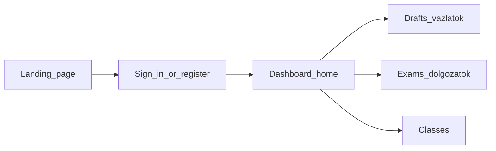

# TanárSegéd — User Guide

This guide describes **TanárSegéd** from a **teacher’s perspective**: what the product is for, how you move around it, and what you can expect—especially around drafts, exams, classes, and optional AI assistance.

---

## 1. Introduction

**TanárSegéd** (“Teacher’s Assistant”) is a web application intended for **teachers** who want to spend less energy on repetitive administration and more on teaching. The workspace brings together **draft documents**, **assessments (“dolgozatok”)**, and **class–student organisation**, with optional AI features where they appear in the interface.

The **primary audience** of this guide is **registered teachers** using the logged-in dashboard. Short notes are included for **people who only open a shared link** (for example a read-only draft).

---

## 2. What problem it aims to solve

TanárSegéd is positioned around everyday teacher pain points:

- **Time**: freeing time for students (and for yourself) by reducing work in preparation and follow-up.
- **Optional AI**: assistance you can invoke when you want it, not a requirement for using the rest of the product.
- **Hybrid workflows**: combining printable materials with digital follow-up where the product supports it (see marketing copy on the public landing page for the full narrative).

---

## 3. Account and access

### Registration

You create an account through the **registration** flow (for example under **`/auth/register`**). You typically provide your name and email and complete the steps shown on screen. After a successful registration you can proceed to sign in.

### Sign-in (email code)

Sign-in uses your **email address** and a **one-time code** sent to that inbox (often described as OTP login):

1. Enter your email and request a code.
2. Enter the code you received.
3. After verification, your session is established and you can use the application.

You can **sign out** from the user menu in the dashboard navigation.

---

## 4. Main workspace (dashboard)

After authentication you reach the **dashboard**, roughly under **`/dashboard`**.

- The **home** area greets you by name and surfaces shortcuts to main areas such as **Drafts** and **Exams**, plus a short list of **recently edited drafts** when available.
- Some tiles describe **upcoming** capabilities explicitly (“coming soon” style wording)—treat those as **planned**, not necessarily available today.

**Routes you may use often**

| Area | Typical path prefix |
|------|---------------------|
| Dashboard home | `/dashboard` |
| Drafts | `/dashboard/vazlatok`, `/dashboard/vazlatok/[id]` |
| Exams | `/dashboard/dolgozatok`, `/dashboard/dolgozatok/[id]`, new exam flow under `/dashboard/dolgozatok/uj` |
| Classes | `/dashboard/classes/...` (list, create, class detail) |

---

## 5. Drafts (Vázlatok)

**Drafts** are documents you create and edit inside the app, for example sheets or preparation notes.

- From the **draft list** you can **open** existing drafts or **create** a new one.
- The **editor** lets you work with structured content (rich text-style editing in the product sense).
- Drafts can be associated with **chat-style AI help** where the UI exposes it; availability depends on the screen you are on.

### Sharing a draft

Teachers can share content via **link-based access**. A recipient opening **`/share/vazlatok/[token]`** sees the shared draft in a **read-oriented** experience when the link is valid. If the link is invalid or expired, the product explains that the shared draft is not available.

---

## 6. Exams (Dolgozatok)

The **Dolgozatok** section is where you work with **saved assessments**.

- The **list** shows your exams and lets you **create a new exam** when none exist yet.
- Opening an exam takes you to an **editor** where you compose **questions**—for example by arranging question types on a canvas—and manage metadata such as the title. **Save** and **delete** actions appear in the workflow with status feedback on screen.

Behind the scenes the product can support **submissions**, **review**, and related operations as exposed in the interface (for example grading views or AI-assisted review where present). **Exact screens and labels evolve**; rely on what you see in the app for the current feature set.

The **dashboard** may still describe broader exam features as **rolling out** (“tasks, grading and feedback in one place” style wording)—interpret that as **directional** messaging, not a guarantee that every sub-feature is finished.

---

## 7. Classes, subjects, and students

The **Classes** area (under **`/dashboard/classes/...`**) supports **organising classes**—for example listing classes, creating a class, opening a class, and managing related data where the UI provides controls.

Depending on the screen, you may see **students**, **members**, or **subject-related** information aligned with how your organisation uses the product. This guide does not duplicate technical API details; use the on-page labels as the source of truth.

---

## 8. AI and professional responsibility

TanárSegéd’s own FAQ-style messaging applies:

- **AI is optional.** You can use other features without relying on AI.
- Where AI **suggests** scores or edits, the **teacher remains responsible** for decisions—especially official grades.
- If the system is **uncertain**, the intent is that it **surfaces uncertainty** and invites **your judgement**, rather than silently deciding.

Always apply your **professional standards** and **school policies** when accepting or overriding suggestions.

---

## 9. Trust, handwriting, and grading

Themes reflected in the product’s public FAQ include:

- **Handwriting**: capabilities described around improved readability of handwritten input for digitisation and analysis—subject to what the current workflow actually shows you step by step.
- **Legal / pedagogical acceptability**: automation as **support**, with **human approval** for official marks.

Refer to the in-product explanations and your institution’s rules for authoritative compliance guidance.

---

## 10. Limitations and roadmap

Transparency matters:

- Some **marketing** sections describe **future** statistics or analytics modules—those may not be fully available yet.
- The dashboard **reserves space** for **additional modules** (“stay tuned” style messaging).

When in doubt, trust **labels and empty states** in the live app over any static document.

---

## 11. If you receive a link as a student or viewer

- **Shared draft**: If someone sends you a **`/share/vazlatok/...`** link, you may view that draft without being the owner. Invalid links show an explanatory message.
- **Public exam flows**: Exam participation via tokenised links may exist depending on deployment and configuration; follow instructions from your teacher.

---

## 12. Glossary

| Term | Meaning in this product |
|------|-------------------------|
| **TanárSegéd** | Name of the application (“Teacher’s Assistant”). |
| **Vázlat** | Draft document (often articles or notes in the editor). |
| **Dolgozat** | Assessment / exam paper as managed in the Dolgozatok module (questions, submissions, grading flows as shown in UI). |
| **OTP / email code** | One-time code sent to your email for passwordless login. |
| **Dashboard** | Logged-in home and navigation shell under `/dashboard`. |

---

*This guide reflects the frontend structure and user-visible strings of the TanárSegéd web app. Backend behaviour and deployed URLs depend on your environment.*
