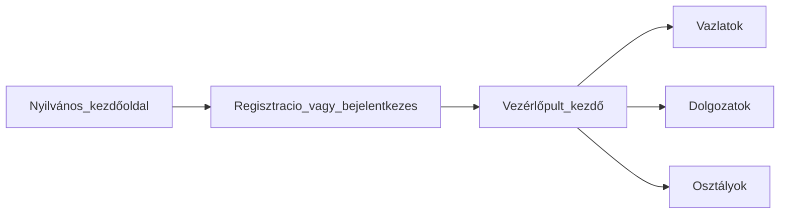

# TanárSegéd — Felhasználói útmutató

Ez az útmutató **TanárSegéd** szolgáltatást **tanári szemmel** mutatja be: mire való, hogyan lehet benne navigálni, és mit érdemes várni — különösen a vázlatok, dolgozatok, osztályok és az opcionális MI-segítség kapcsán.

---

## 1. Bevezetés

A **TanárSegéd** egy webes alkalmazás, elsősorban **pedagógusoknak**, akik kevesebb energiát szeretnének az ismétlődő adminisztrációra fordítani, és többet a tanításra. A munkafelület egy helyen fogja össze a **vázlat dokumentumokat**, a **dolgozatok (feladatsorok) kezelését**, valamint az **osztály–diák szervezést**, opcionális MI-funkciókkal ott, ahol a felület ezt megjeleníti.

Az útmutató **elsődleges célcsoportja** a **bejelentkezett, regisztrált tanár**. Röviden szólunk arról is, ha valaki **csak egy megosztott linket** kap (például megtekinthető vázlat).

---

## 2. Milyen problémára válaszol

A TanárSegéd üzenete a mindennapi tanári terhekhez igazodik:

- **Idő**: több idő a diákokra (és önmagára) az előkészület és az utókövetés gördülékenyebbé tételével.
- **Opcionális MI**: segítség, amit akkor vesz igénybe, amikor szeretné — nem feltétel a többi funkció használatához.
- **Hibrid megoldások**: nyomtatható anyag és digitális utókövetés összekapcsolása ott, ahol a termék ezt támogatja (a nyilvános kezdőoldal részletes narratíváját lásd a felületen).

---

## 3. Fiók és belépés

### Regisztráció

A fiókot a **regisztrációs** folyamatban hozhatja létre (például a **`/auth/register`** útvonalon). Nevét és e-mail címét általában meg kell adnia, majd a képernyőn látható lépéseket követve zárhatja a regisztrációt. Siker után jöhet a bejelentkezés.

### Bejelentkezés (e-mailben kapott kód)

A belépés az **e-mail címe** és a **postafiókjába küldött egyszer használatos kód** alapján történik (jellemzően OTP-s bejelentkezés):

1. Adja meg az e-mail címét, és kérjen kódot.
2. Írja be a kapott kódot.
3. Ellenőrzés után létrejön a munkamenet, és használhatja az alkalmazást.

A **kijelentkezés** a vezérlőpult navigációjában, a felhasználói menüből érhető el.

---

## 4. Fő munkaterület (vezérlőpult)

Hitelesítés után a **vezérlőpultra** érkezik (jellemzően a **`/dashboard`** alá).

- A **kezdő nézet** név szerint köszönti, és gyors elérést ad például a **Vázlatok** és **Dolgozatok** felületekhez, valamint — ha van adat — a **legutóbb szerkesztett vázlatok** rövid listájához.
- Egyes csempék **„hamarosan” / fejlesztés alatt** típusú szöveggel utalnak funkciókra — ezeket **tervezettnek**, nem feltétlenül ma elérhetőnek tekintse.

**Gyakran használt útvonalak**

| Terület | Jellemző útvonal |
|---------|------------------|
| Vezérlőpult kezdő | `/dashboard` |
| Vázlatok | `/dashboard/vazlatok`, `/dashboard/vazlatok/[id]` |
| Dolgozatok | `/dashboard/dolgozatok`, `/dashboard/dolgozatok/[id]`, új dolgozat: `/dashboard/dolgozatok/uj` |
| Osztályok | `/dashboard/classes/...` (lista, létrehozás, osztály részletek) |

---

## 5. Vázlatok

A **vázlatok** a rendszerben létrehozott és szerkesztett dokumentumok — például cikkek vagy felkészülési jegyzetek.

- A **vázlatlista** megnyithatóvá teszi a meglévőket, és **új vázlat** indítható.
- A **szerkesztő** strukturált tartalommal dolgozik (a termék értelmében „gazdag szöveges” szerkesztés).
- A felületen megjelenő **MI-hez kapcsolódó beszélgetős segítség** ott érhető el, ahol a képernyő ezt felkínálja; elérhetőség nézetenként változhat.

### Vázlat megosztása

A tanár **linken keresztül** oszthat meg tartalmat. A címzett a **`/share/vazlatok/[token]`** címen **jellemzően megtekintő jellegű** nézetet kap, ha a link érvényes. Érvénytelen vagy lejárt link esetén az alkalmazás közli, hogy a megosztott vázlat nem elérhető.

---

## 6. Dolgozatok

A **Dolgozatok** szekcióban a **mentett felmérések / dolgozatok** kezelhetők.

- A **lista** megjeleníti a dolgozatokat; üres állapotban **új dolgozat** indítható a felület szövege szerint.
- Egy dolgozat megnyitása **szerkesztőnézetbe** visz: **kérdéseket** állít össze (például kérdéstípusok áthúzásával egy „vászonra”), és metaadatokat kezel (pl. cím). **Mentés** és **törlés** része a folyamatnak; állapotüzenetek a képernyőn jelennek meg.

A háttérben **beadások**, **értékelés**, esetleg **MI-alapú áttekintés** társulhat a felületen látható funkciókhoz. **A pontos képernyők és feliratok fejlődhetnek** — mindig az élő alkalmazásban látottak az irányadók.

A **vezérlőpulton** a dolgozatokról szóló szöveg részben **irányvonal**: „feladatok, osztályozás és visszajelzés egy helyen” típusú megfogalmazás — ezt **fejlesztési iránynak** fogja fel, nem ígéretnek minden részfunkcióra nézve.

---

## 7. Osztályok, tantárgyak, tanulók

Az **Osztályok** rész (`/dashboard/classes/...`) az **osztályok szervezésére** szolgál: lista, új osztály, osztály megnyitása, és a felületen elérhető további adatok kezelése.

A konkrét képernyőktől függően **tanulók**, **tagok** vagy **tantárgyhoz kötött** információk jelenhetnek meg. Ez az útmutató nem váltja ki a technikai API dokumentációt — a **felületen látható címkék és űrlapok** a mérvadók.

---

## 8. MI és szakmai felelősség

A termék nyilvános GYIK-jéhez igazodva:

- **Az MI használata nem kötelező.** Más funkciók MI nélkül is használhatók.
- Ahol az MI **javaslatot** tesz (például pontszámra vagy javításra), a **pedagógus marad a felelős** a döntésért — különösen a hivatalos jegy tekintetében.
- Ha a rendszer **bizonytalan**, a szándék az, hogy **jelzi** ezt, és **az Ön véleményét** kéri — nem hallgatja el a bizonytalanságot.

Mindig saját **szakmai elvárásai** és **intézményi szabályai** szerint hagyja jóvá vagy utasítsa el a javaslatokat.

---

## 9. Bizalom, kézírás, értékelés

A nyilvános GYIK témái közül:

- **Kézírás**: olyan képességek szerepelnek a kommunikációban, amelyek a nehezebben olvasható kézírás „kibogarászását” és digitális feldolgozást segítik — a tényleges lépések a felületen követhetők.
- **Jogi / pedagógiai megfontolás**: automatizálás **támogatásként**, **emberi jóváhagyással** a hivatalos eredményhez.

Részletes jogi megfeleléshez az intézmény szabályai és szakértői vélemény a mérvadó.

---

## 10. Korlátok és ütemterv

Átláthatóság:

- A **marketing** egyes részei **jövőbeli** statisztikai modulokról beszélnek — ezek még nem feltétlenül teljes funkcióként élnek.
- A vezérlőpulton **helyet tartanak fenn** **további moduloknak** („stay tuned” típusú üzenet).

Bizonytalanság esetén mindig az **élő alkalmazás szövegei és üres állapotai** irányadók egy statikus dokumentumnál.

---

## 11. Ha diákként vagy nézőként kap linket

- **Megosztott vázlat**: Ha **`/share/vazlatok/...`** linket kap, a tulajdonos nélkül is megtekintheti a vázlatot, ha a link érvényes. Érvénytelen linknél magyarázó üzenet jelenik meg.
- **Nyilvános dolgozat**: Tokenes részvétel attól függően érhető el, hogyan van üzembe állítva a környezet — kövesse a tanár utasításait.

---

## 12. Fogalomtár

| Fogalom | Jelentés a termékben |
|---------|---------------------|
| **TanárSegéd** | Az alkalmazás neve. |
| **Vázlat** | Szerkesztett dokumentum (cikk, jegyzet jellegű anyag a szerkesztőben). |
| **Dolgozat** | Felmérés / feladatsor a Dolgozatok modulban (kérdések, beadások, értékelés — ahogy a felület mutatja). |
| **OTP / e-mail kód** | Egyszer használatos kód a jelszó nélküli belépéshez. |
| **Vezérlőpult** | Bejelentkezett kezdő nézet és navigáció a `/dashboard` alatt. |

---

*Ez az útmutató a TanárSegéd webalkalmazás felületéhez és felhasználói szöveghez igazodik. A háttér szolgáltatások és a telepített URL-ek a környezettől függnek.*
